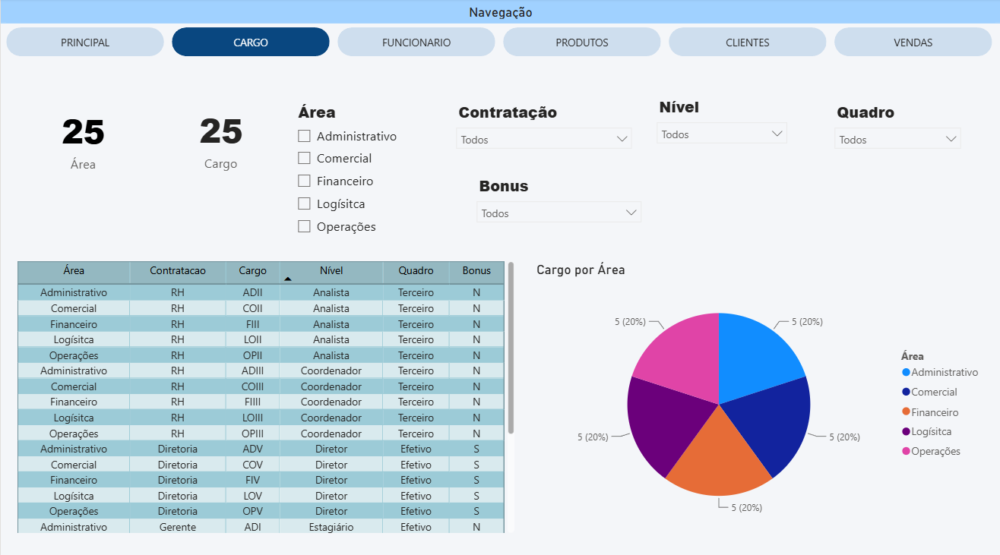
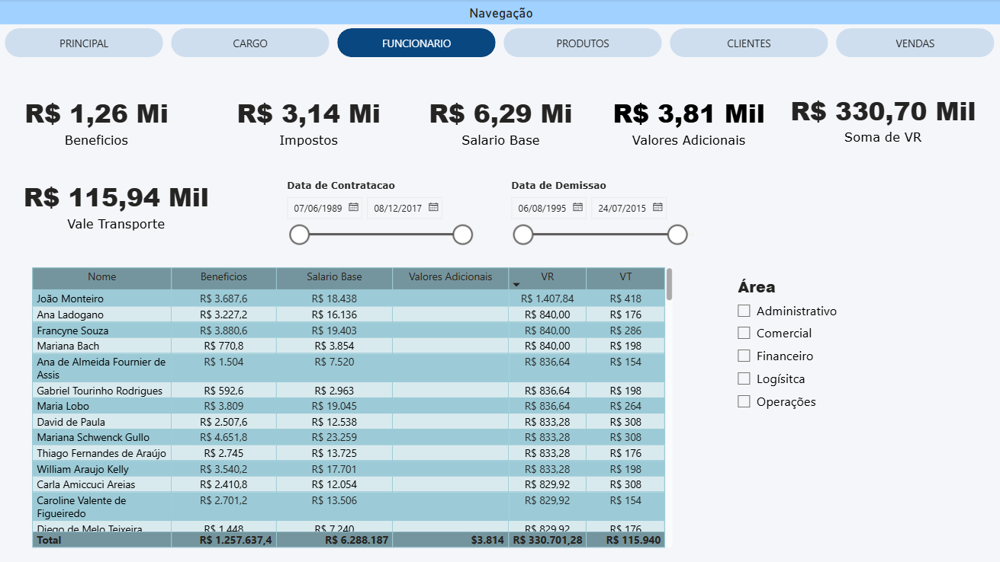
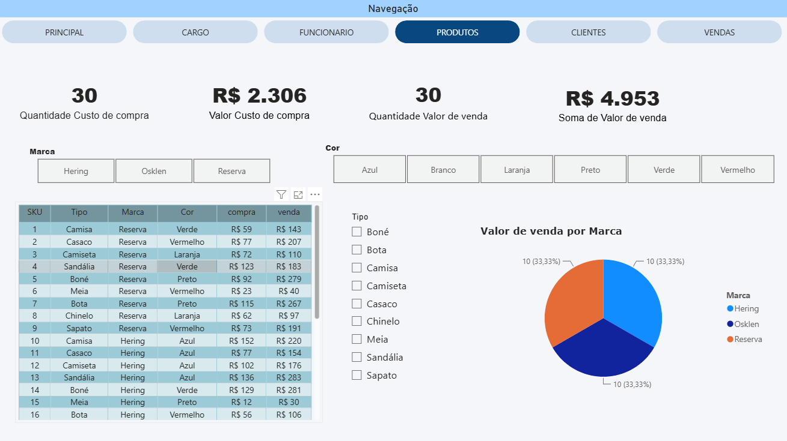
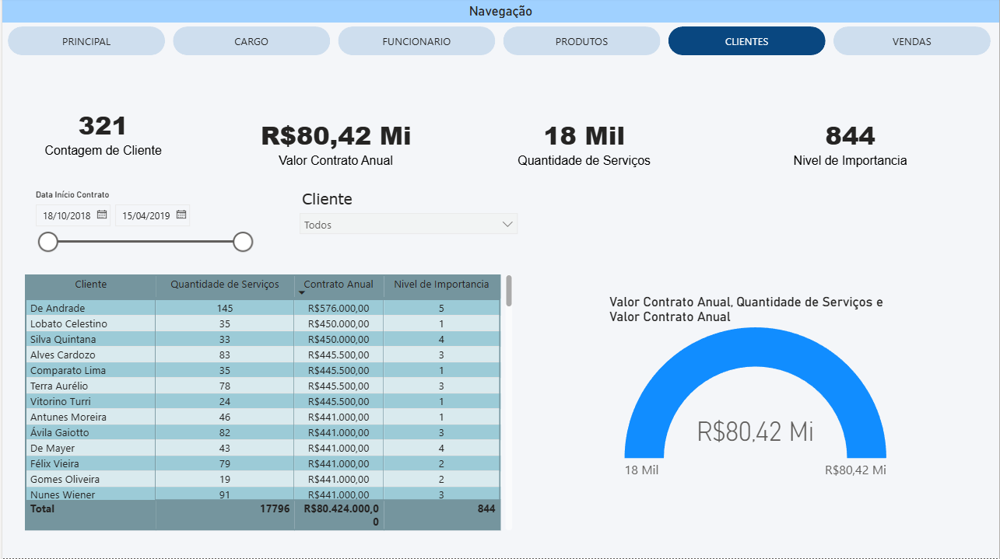
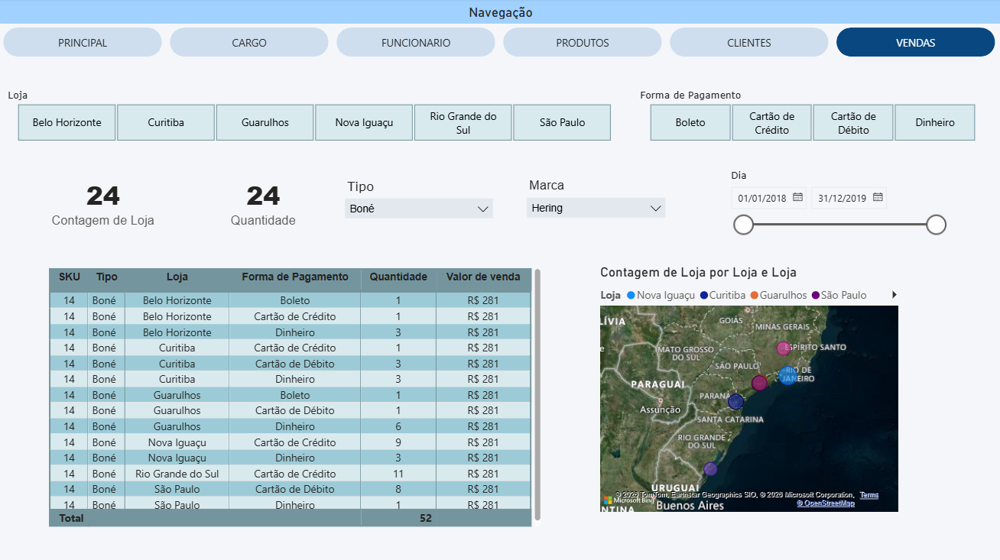

# 📊 Power BI Projects

<div align="center">


### Projetos e estudos de visualização de dados, dashboards e modelagem em Power BI

</div>

---

## 📌 Sobre este repositório

Este repositório reúne meus projetos e estudos em **Power BI**, desenvolvidos com o objetivo de praticar conceitos de análise e visualização de dados.

Os projetos envolvem criação de dashboards, organização e relacionamento de dados, utilização de diferentes tipos de visuais e exploração de informações por meio de filtros e segmentações.

---

## 🗂️ Projeto

### 📈 Dashboard de Vendas — SAS

Dashboard desenvolvido a partir de bases fictícias relacionadas a **vendas, clientes, produtos e funcionários**.

O projeto foi desenvolvido com o objetivo de praticar a construção de dashboards e a organização de dados no Power BI.

### 📄 Arquivo

[**dashboard-vendas-sas.pbix**](dashboard-vendas-sas.pbix)

---

## 📊 Páginas do relatório

O dashboard possui diferentes páginas para apresentar e explorar as informações do conjunto de dados.

### 🏠 Página Principal

Página inicial do dashboard, reunindo informações gerais e indicadores para uma visão inicial dos dados.

---

### 👔 Página Cargo

Apresenta informações relacionadas aos cargos dos funcionários.



---

### 👤 Página Funcionário

Página dedicada à visualização das informações dos funcionários.



---

### 📦 Página Produtos

Apresenta informações relacionadas aos produtos cadastrados e suas respectivas vendas.



---

### 🧑‍🤝‍🧑 Página Clientes

Página com informações relacionadas aos clientes.



---

### 💰 Página Vendas

Apresenta informações relacionadas às vendas e permite explorar os dados utilizando diferentes filtros.



---

## 🛠️ Recursos utilizados

- **Power BI Desktop**
- **Power Query**
- Importação de dados via Excel
- Modelagem de dados
- Relacionamentos entre tabelas
- Segmentações de dados (Slicers)
- Cards
- Gráficos
- Tabelas
- Gauge
- Mapas
- Filtros

---

## 🎯 Objetivos do projeto

- Praticar a importação e transformação de dados;
- Aprender a organizar dados para criação de relatórios;
- Criar relacionamentos entre tabelas;
- Desenvolver dashboards com múltiplas páginas;
- Explorar diferentes tipos de visualizações;
- Utilizar filtros e segmentações de dados;
- Desenvolver maior familiaridade com o Power BI.

---

## 🧠 O que aprendi

Durante o desenvolvimento deste projeto, pratiquei:

- Importação de dados a partir de planilhas Excel;
- Organização e tratamento de dados;
- Criação de relacionamentos entre tabelas;
- Construção de páginas de relatório;
- Utilização de diferentes tipos de gráficos e indicadores;
- Aplicação de filtros e segmentações;
- Organização visual de dashboards;
- Exploração de dados para obtenção de informações.

---

## 🚧 Próximas melhorias

Este projeto faz parte do meu processo de aprendizado em Power BI. Algumas melhorias que pretendo realizar futuramente são:

- [ ] Criar medidas utilizando DAX;
- [ ] Melhorar a modelagem do banco de dados;
- [ ] Criar uma tabela calendário;
- [ ] Revisar os relacionamentos entre as tabelas;
- [ ] Revisar a nomenclatura das tabelas e colunas;
- [ ] Adicionar novos dashboards ao repositório.

---

## ▶️ Como abrir o projeto

Para visualizar o dashboard:

1. Instale o **Power BI Desktop**.
2. Faça o download ou clone este repositório.
3. Abra o arquivo:

```text
dashboard-vendas-sas.pbix
